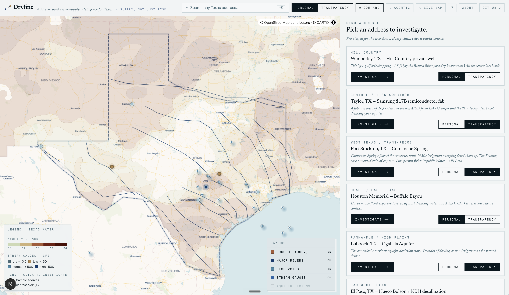
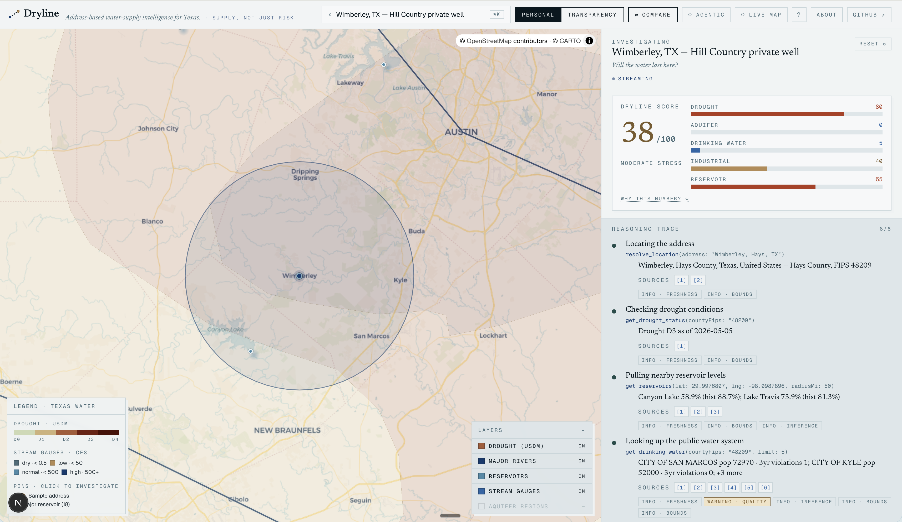
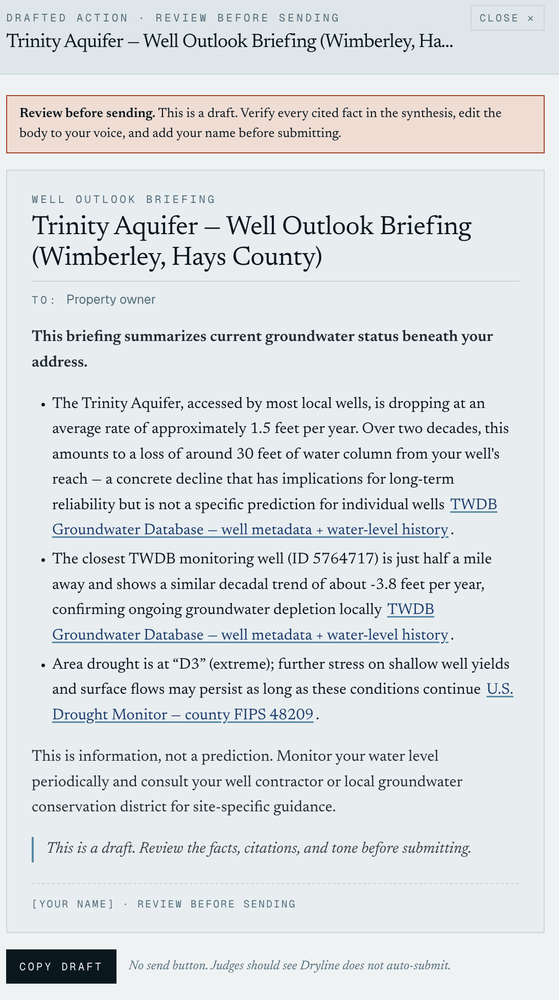

# Dryline

**Investigate Texas water at any address.**

*Environmental intelligence for a thirsty state.*

Built for the [AITX × Codex Hackathon](https://luma.com/aitx-codex-hackathon) (May 9–10, 2026, Antler ATX). Submitting to:
- **Brainforge / Vicinity Texas Open Data Track**
- **Agents Track**

**Live demo:** [dryline-web.vercel.app](https://dryline-web.vercel.app/)
**Repo:** [github.com/willhines90/dryline](https://github.com/willhines90/dryline)

---

## The 90-second pitch

Texas added 4 million people in five years. Our water didn't keep up. The data is real, public, and federally published — but it's spread across a stack of state and federal agencies, each with a different update cadence, access pattern, and freshness profile. By the time a homeowner finds out their groundwater table dropped twelve feet last decade, or that a new fab three miles upstream just got a discharge permit, the comment window has closed.

Dryline collapses that distance. Type any Texas address. An agent fans out across drought, reservoirs, drinking water, aquifer monitoring, federally-reportable industrial dischargers, stream gauges, and active permits — returning each tool's result with **inline citations and structured caveats**. No black-box answers, no hedged guesses. A 0–100 Dryline Score lands first, a synthesis card lands the situation in 2–4 paragraphs of cited prose, and an inline action card surfaces a drafted civic-action artifact: a watering reminder, a well-outlook briefing, a public comment with a real NPDES permit ID, a letter to a Groundwater Conservation District, or a Public Information Act request.

Same investigation, two presentations:

| Mode | Question type | Default artifact |
|---|---|---|
| **Personal** — *Will the water last here?* | Lived-experience: well owners, utility customers, families considering a move. Leads with the local aquifer trend and the utility's compliance posture. | `watering_reminder` or `well_outlook_briefing` |
| **Transparency** — *Who's drinking your aquifer?* | Systemic: journalists, civic researchers, residents tracking nearby industrial buildouts. Leads with a *tension flag* pairing two facts (e.g., reservoir below historical average + large permitted draw nearby). | `public_comment`, `gcd_letter`, or `pia_request` |

---

## Where Dryline sits

The one-line version: **the address-based environmental tools you know stop where water supply begins.**

| Tool | Tells you | Doesn't |
|---|---|---|
| First Street / Risk Factor | Flood, fire, heat at any address | Water supply |
| EPA EJScreen | Pollution + EJ indicators by Census block | Address-level water supply |
| TWDB dashboards | Texas water in aggregate | Anchored to your address |
| TLWP Scorecard | Conservation by utility | Interactive · narrative · timely |

Dryline stacks four layers nobody else does in one place: **synthesis** (five+ portals into one picture), **interpretation** (data into meaning), **action** (citation-backed civic comment), and **water-as-the-lens** (address-anchored, supply-focused, Texas-deep). Full analysis in [LANDSCAPE.md](./LANDSCAPE.md).

---

## First-time-user quickstart

Never used Dryline? Read this once and you're set.

1. **The map (left side).** Texas under a current-week U.S. Drought Monitor color wash. Tide-blue dots are the 18 major TWDB-instrumented reservoirs. Mode-colored dots (aquifer-blue or ochre) are the seven pre-staged demo addresses. Click any of them — or use the search bar (⌘K) to type your own address.

2. **The right panel.** Once an address is picked, the panel transforms into the active investigation. Read it top-to-bottom:
   - **Dryline Score** at the top — a single 0–100 number summarizing water stress at this address. Hover *Why this number?* for the per-subscore rationale.
   - **Synthesis** next — 2–4 paragraphs of cited prose. Every fact-bearing sentence links to its source URL with a retrieval timestamp.
   - **Action card** below the synthesis — an aquifer-stripe card with the drafted civic-action artifact's title and a 3-line preview. Click *Open draft →* to expand the full letter.
   - **Reasoning trace** at the bottom — every tool call streams in as it lands, with a one-line plain-English label, citation chips ([1] [2] …) linking to the actual public source, and structured caveat badges (info / warning / error · category). Acts as supporting evidence beneath the headline.

3. **The drafted artifact.** Clicking *Open draft →* slides in a full-width drawer with the drafted civic-action document — a public comment, a watering reminder, a GCD letter, or a Public Information Act request, formatted as a letter with `To:` / `RE:` headers. There's a **Review before sending** banner above it. There is no auto-submit. The agent puts a draft in your hands; you decide what to do with it.

4. **Compare two addresses.** Click the **Compare** toggle in the header. Pick two demo addresses (or two free-text addresses). The panel splits — primary on top, secondary below — and a hero strip lights up above both showing the two Dryline Scores side by side and the three biggest subscore deltas. Useful for "Wimberley vs Taylor" stories.

5. **See the agent really decide.** Click the **Agentic** toggle in the header. Future investigations now hit `/api/investigate?agent=1` — a real OpenAI Responses-API tool-calling loop where the model picks which tools to call. Slower (≈30 s vs the deterministic ≈18 s), more variable, but the agent's judgment is on stage. We've watched it skip `get_big_users_nearby` for personal-mode rural addresses and skip `get_drinking_water` when the story is groundwater. Toggle off for rehearsed demo timing.

---

## Acronyms — read first if any of these are unfamiliar

Texas water lives in the agency stack. Hover any underlined abbreviation in the app for a definition; here's the full set in one place.

### Agencies & datasets

| Short | Full | What it is for Dryline |
|---|---|---|
| **TWDB** | Texas Water Development Board | The state agency that funds and tracks water-supply data. We pull reservoir levels and the Groundwater Database from them. |
| **GWDB** | TWDB Groundwater Database | A nightly-refreshed pipe-delimited dump of every Texas monitoring well's metadata + historical water-level readings. Source for `get_aquifer_status`. |
| **USDM** | U.S. Drought Monitor | A federal weekly classification of drought severity, county-level: None / D0 (abnormal) / D1 (moderate) / D2 (severe) / D3 (extreme) / D4 (exceptional). |
| **USGS** | U.S. Geological Survey | Federal earth-science agency. Operates the NWIS stream-gauge network. |
| **NWIS** | USGS National Water Information System | Public REST service for stream gauges. Source for `get_river_flow`. |
| **EPA** | U.S. Environmental Protection Agency | Federal regulator. We draw on EPA's ECHO and SDWIS systems. |
| **ECHO** | EPA Enforcement and Compliance History Online | Public API surface for federally-reportable permits, facilities, and enforcement. Sources for `get_drinking_water`, `get_big_users_nearby`, `get_active_permits`. |
| **SDWIS** | EPA Safe Drinking Water Information System | Federal database of public water systems and their compliance with the Safe Drinking Water Act. |
| **CWA** | Clean Water Act | The federal law that governs surface-water discharge, NPDES permits, and effluent standards. |
| **NPDES** | National Pollutant Discharge Elimination System | The federal permit program for any pollutant entering U.S. surface waters. NPDES IDs (e.g. `TX0142646` for Wimberley's Blue Sky WRF) appear in the public-comment drafts. |
| **TCEQ** | Texas Commission on Environmental Quality | The Texas state environmental regulator. Most state-only permits (water rights, RG-211) live here. We don't yet integrate TCEQ's web forms. |

### Permit, system, and unit terms

| Short | Full | Notes |
|---|---|---|
| **PWS** | Public Water System | A utility regulated under the Safe Drinking Water Act. |
| **PWSID** | Public Water System ID | Federal identifier, e.g. `TX1050018` = Wimberley Water Supply Corporation. |
| **GCD** | Groundwater Conservation District | A Texas local-government unit that regulates groundwater pumping. Created county-by-county. |
| **WCID** | Water Control and Improvement District | A Texas local-government unit that supplies water and/or wastewater service. |
| **DMR** | Discharge Monitoring Report | An EPA-required self-report by NPDES permittees. |
| **DFR** | Detailed Facility Report | EPA ECHO's per-facility public dashboard. Linked from every Dryline permit result. |
| **HUC** | Hydrologic Unit Code | USGS hierarchical watershed identifier (HUC-2 down to HUC-12). |
| **FIPS** | Federal Information Processing Standards code | 5-digit county identifier. `48209` = Hays County, TX. |
| **MCL** | Maximum Contaminant Level | Highest legally allowable concentration of a contaminant in drinking water under SDWA. |
| **MRDL** | Maximum Residual Disinfectant Level | Like an MCL, for the disinfectant itself (chlorine, chloramine). |
| **TT** | Treatment Technique | An SDWA compliance category for procedures (vs concentration limits). |
| **MGD** | Million gallons per day | Standard unit for permitted discharge or supply volume. |
| **CFS** | Cubic feet per second | Standard unit for stream discharge. |
| **PIA** | Public Information Act | The Texas open-records law (Government Code Chapter 552). |

### Architecture terms

| Short | Full | Notes |
|---|---|---|
| **MCP** | Model Context Protocol | Anthropic's open standard for letting AI agents call external tools and resources. Dryline ships an MCP server. |
| **SSE** | Server-Sent Events | One-way streaming over plain HTTP. How `/api/investigate` streams reasoning-trace events to the browser. |

---

## Screenshots

The cinematic flow, in three frames. Capture pass happens during PHASE 5 visual verification.

| | |
|---|---|
| **Map view** — All seven demo locations marked. Topographic basemap; reservoir-blue accents on arid earth. |  |
| **Investigation in flight** — Reasoning trace streaming, citation chips alive, synthesis card materializing. |  |
| **Public comment draft** — Action drawer open, drafted letter with cited NPDES IDs, *Review before sending* notice, copy-to-clipboard button. |  |

---

## The Dryline Score

Each investigation produces a single 0–100 number — the **Dryline Score** — at the top of the synthesis card. Higher = more water stress at that address. The number is the lede; the cited synthesis underneath is the why.

**Composite of five subscores, equally weighted, integer mean:**

| Subscore | Source | Scale |
|---|---|---|
| **Drought** | U.S. Drought Monitor county category | None=0, D0=20, D1=40, D2=60, D3=80, D4=100 |
| **Aquifer** | TWDB monitoring-well decadal trend | ≤0 ft/yr (rising/steady) = 0; 0.5 = 30; 1.0 = 50; 1.5 = 70; 2.0+ = 90 |
| **Drinking water** | EPA SDWIS (via ECHO) for the primary serving system | +30 per current health-based violation, +10 per current procedural, +5 per rule violated in last 3 yr; cap 100 |
| **Industrial** | Count of individual NPDES permittees within 15 mi (EPA ECHO) | 0=0, 1=20, 2-3=40, 4-6=60, 7+=80 |
| **Reservoir** | Nearest TWDB-instrumented reservoir's current % full vs same-day historical avg | ratio ≥1.05=0, 1.0=20, 0.85=40, 0.70=60, 0.55=80, ≤0.40=100 |

Subscores with no available data score 50 (neutral) and the rationale field records the gap. The UI surfaces a "Why this number?" disclosure that shows each subscore's per-address rationale.

**The number is reductive on purpose — and it will sometimes surprise you.** Wimberley scores 38/100 even on a D3-drought day, because the *single nearest* monitoring well at that address happens to be recovering — depth-to-water decreased from 180 ft in 2007 to ~102 ft in 2019 at well 5764717. Regional Trinity trends are worse; this single well isn't. The score is honest about that single-well coverage limit. Don't treat the score as an oracle; click through to the synthesis for the cited story.

---

## Architecture choice — read this carefully

Dryline ships its tools as **both a stdio MCP server** (`@dryline/mcp`) **and as in-process function tools for the web app**. The web demo uses a deterministic tool sequence by default for sub-25 s reliability; an `?agent=1` query flag enables real LLM-driven tool selection via the OpenAI Responses API. The MCP server is the composable artifact — anyone can attach it to Claude Code, Codex, or Cursor. The agent's judgment shows up in synthesis emphasis, action-artifact selection, and citation discipline.

**Why deterministic by default for the web demo.** A managed agent loop adds model round-trips on top of `max(tool_latencies)`, which pushed dense-metro investigations to 50–70 s wall-clock under variable OpenAI load. The toolset is **eight tools** total: `resolve_location` runs first, then the other seven (`get_drought_status`, `get_reservoirs`, `get_drinking_water`, `get_big_users_nearby`, `get_aquifer_status`, `get_river_flow`, `get_active_permits`) fan out in parallel. Pre-fetching that fan-out keeps the cinematic trace identical from the user's side (`tool_start` and `tool_result` SSE events still stream in real time as each tool resolves) while bringing every investigation under the 25 s budget. The synthesis-only Responses API call is where the model's judgment lands — the system prompt is the [skill brief](skill/SKILL.md), the user message includes the fixture's narrative framing, and the artifact selection (and refusal to invent docket numbers) is the agent's call.

**The `?agent=1` flag.** Hit `POST /api/investigate?agent=1` and the same SSE contract is served by a real Responses-API tool-calling loop: the model sees all eight tools, decides which to call (`resolve_location` is always first; the other seven are at the model's discretion), and emits the same `tool_start`/`tool_result`/`synthesis`/`artifact` events. Capped at 50 s wall-clock and 8 iterations. We've observed the model legitimately *skip* tools — Personal-mode Wimberley dropped `get_big_users_nearby`; Fort Stockton sometimes drops `get_drinking_water` to focus on groundwater — which is the right judgment call but produces variable trace shapes that the deterministic path avoids. The flag is the honesty knob: judges who want to see the LLM driving tool selection can pop it on; live demos that need rehearsed timing keep it off.

The contract types (`mcp/src/types.ts` and the hand-mirrored `web/lib/types.ts`) are the wire boundary. The web app does not import from `@dryline/mcp` for type purposes other than to share the in-process registry; runtime decoupling stays clean so the MCP server can move to a different language without dragging the UI with it.

---

## Repo layout

```
dryline/
├── mcp/                  MCP server (stdio) + the canonical tool registry.
│   ├── src/tools/        One file per tool; all return { data, caveats[], sources[] }.
│   └── src/data/         Curated snapshots (TWDB GWDB → aquifers.json).
├── skill/                Agent skill: SKILL.md + worked examples + data-source catalog.
├── web/                  Next.js + MapLibre + shadcn/ui investigation surface.
│   ├── app/              page.tsx + the api/investigate SSE route.
│   ├── components/dryline/  Cinematic flow components.
│   └── lib/              Wire-type mirror, Markdown renderer, utils.
├── fixtures/             Canonical demo addresses.
├── PROPOSAL.md           Project thesis: scope, demo lineup, what not to build.
├── LANDSCAPE.md          Competitive analysis: where Dryline sits, what's missing in market.
├── EXTENSIONS.md         Post-hackathon roadmap.
├── DEMO.md               Live three-minute demo script (beat sheet).
├── PITCH.md              Five-minute pitch narrative.
└── LOOM.md               Recorded demo-video script (~4 min, camera-on, single take).
```

---

## Architectural contract — non-negotiable

Every MCP tool returns:

```ts
type ToolResult<T> = {
  data: T | null;          // null on partial failure; never throw across the boundary
  caveats: Caveat[];       // freshness, quality, bounds, inference — structured
  sources: Source[];       // {title, url, retrievedAt, publisher} — every claim cited
};
```

`caveats` is *not* a comment field. It's the structured channel for data freshness, known quality issues, what the data does NOT say, and confidence. The web app surfaces caveats and sources directly in the reasoning trace and the synthesis card. **No claim without a source.**

---

## Data sources

Each MCP tool draws from one or more of these. Mirrors [`skill/references/data-sources.md`](skill/references/data-sources.md) — the skill cites whichever the tool returns; this catalog is for human reviewers.

| Source | Publisher | Access | Updated | Caveat the agent surfaces |
|---|---|---|---|---|
| **Nominatim** | OpenStreetMap | REST | Live | Geocoding only; subject to OSM coverage |
| **Census Geocoder** | U.S. Census Bureau | REST | Live | 5xxs under load; we maintain a TX county FIPS fallback |
| **U.S. Drought Monitor** | NDMC / UNL / NOAA / USDA | REST at `usdmdataservices.unl.edu` | Weekly (Thursdays) | County-level summary; subcounty variation not captured |
| **TWDB Water Data for Texas** | TWDB | REST at `waterdatafortexas.org` | Daily | ~37 instrumented major reservoirs; minor systems not included |
| **EPA SDWIS via ECHO** | U.S. EPA | REST at `echodata.epa.gov` | Quarterly + ad hoc | EPA acknowledges 3–6 month state→federal reporting lag; some violations are paperwork, not contamination |
| **EPA ECHO Clean Water Act facilities** | U.S. EPA | REST at `echodata.epa.gov` (bbox + GeoJSON) | Continuous | Permitted ≠ polluting; federal-reportable only; NPDES is discharge, not draw |
| **TWDB Groundwater Database** | TWDB | Nightly pipe-delimited bulk dump | Nightly | Monitoring well coverage uneven; one well does not represent a whole aquifer; locations not state-verified |

**What we deliberately do NOT use:** TCEQ behind-form scraping, private well owner lists, real estate / parcel ownership databases. See [`skill/references/data-sources.md`](skill/references/data-sources.md) for the full attribution rule and exclusions list.

---

## Quickstart

### API keys you'll need

**Just one:** an `OPENAI_API_KEY` for the synthesis call (and the optional `?agent=1` tool-calling loop). All eight data tools — USDM, TWDB, USGS NWIS, EPA SDWIS/ECHO, U.S. Census Geocoder, Nominatim — are **free public APIs that require no key or signup**. The full data stack works offline-from-OpenAI; only the natural-language synthesis card and the LLM-driven agent loop need an OpenAI key.

| Variable | Where it lives | Required? | Notes |
|---|---|---|---|
| `OPENAI_API_KEY` | `web/.env.local` | **Yes** | Used by `/api/investigate` for synthesis. Without it, tools still fire, but no synthesis or artifact is generated. |
| `NOMINATIM_USER_AGENT` | `.env` | Optional | Defaults to `Dryline/0.0.1 (mail@willhin.es)`. Set your own if you fork. |
| `MCP_TRANSPORT` | `.env` | Optional | `stdio` (default) or `http`. |
| `DRYLINE_DUCKDB_PATH` | `.env` | Optional | Path to the GWDB snapshot — defaults to `./mcp/data/dryline.duckdb`. |

```bash
git clone https://github.com/willhines90/dryline.git
cd dryline
pnpm install

# Configure secrets
cp .env.example .env
echo 'OPENAI_API_KEY=sk-...' > web/.env.local

# Terminal 1 — MCP server (stdio)
pnpm dev:mcp

# Terminal 2 — web app
pnpm dev:web
# → http://localhost:3000
```

Click any of the seven demo addresses → **Investigate**. The map flies to the address, the reasoning trace streams the tool calls, the Dryline Score and cited synthesis land in the right panel, and an inline *Open draft →* action card surfaces underneath with the drafted civic-action artifact.

### Useful commands

```bash
pnpm typecheck                              # whole monorepo
pnpm build                                  # whole monorepo
pnpm --filter @dryline/mcp exec \
  tsx scripts/smoke.ts <tool> '<json-args>' # smoke test any tool
```

---

## Documents

- [PROPOSAL.md](./PROPOSAL.md) — full project thesis
- [LANDSCAPE.md](./LANDSCAPE.md) — competitive analysis & gap framing
- [EXTENSIONS.md](./EXTENSIONS.md) — post-hackathon roadmap
- [DEMO.md](./DEMO.md) — live (in-person) demo beat sheet
- [PITCH.md](./PITCH.md) — five-minute in-person pitch
- [LOOM.md](./LOOM.md) — recorded Loom demo script (~4 min, camera-on)
- [SUBMISSION.md](./SUBMISSION.md) — Brainforge + Agents-track submission copy

---

## License

MIT. All public data is cited; we don't redistribute proprietary datasets.
